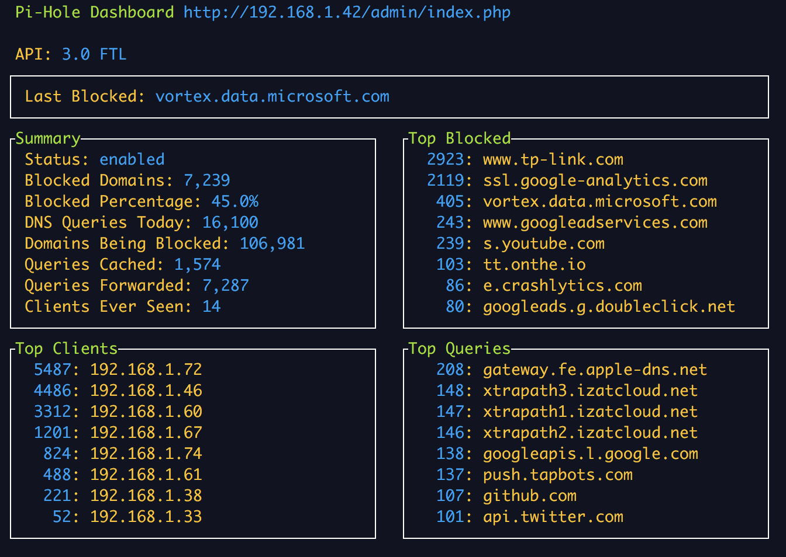

# phstat  [](https://goreportcard.com/report/github.com/shuienko/phstat)
Get [Pi-Hole](https://github.com/pi-hole/pi-hole) metrics remotely using command line.

## download

Get binary from [Releases](https://github.com/shuienko/phstat/releases) and save it somewhere in your `$PATH`

## or build yourself
```bash
go build -o phstat
```

## set environment variables
* get `PIHOLE_TOKEN` here http://your-pi-hole-ip/admin/settings.php?tab=api or here `/etc/pihole/setupVars.conf`
* add it to your `.bashrc` or `.zshrc`:

```bash
export PIHOLE_HOST=your-pi-hole-ip
export PIHOLE_TOKEN=longtokenstring
```


## use

```
Pi-Hole Dashboard. Docs: https://github.com/shuienko/phstat/blob/master/README.md
Usage: phstat [-h] [-n seconds]
  -h	show this page
  -n seconds
    	update interval in seconds (default 2)
```

## ui example

